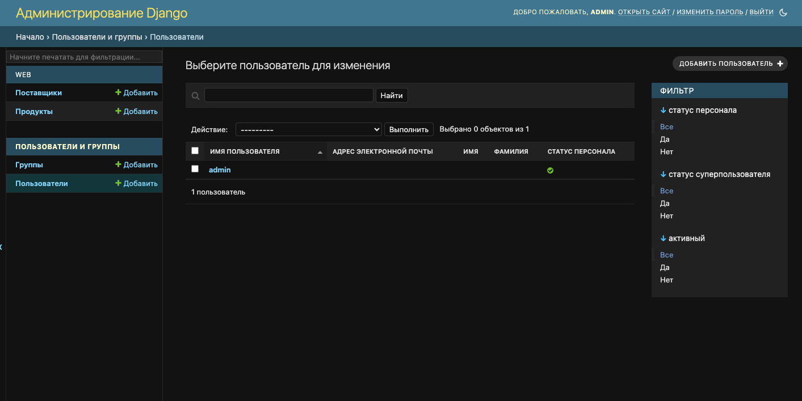

Задание
Создайте веб-приложение, с API интерфейсом и админ-панелью.
Создайте базу данных используя миграции Django.
Требования к реализации:

Необходимо реализовать модель сети по продаже электроники.
Сеть должна представлять собой иерархическую структуру из 3 уровней:

Завод;
Розничная сеть;
Индивидуальный предприниматель.
Каждое звено сети ссылается только на одного поставщика оборудования (не обязательно предыдущего по иерархии). Важно отметить, что уровень иерархии определяется не названием звена, а отношением к остальным элементам сети, т.е. завод всегда находится на 0 уровне, а если розничная сеть относится напрямую к заводу, минуя остальные звенья - её уровень - 1.

Каждое звено сети должно обладать следующими элементами:
Название;
Контакты:
Email;
Страна;
Город;
Улица;
Номер дома;
Продукты:
Название;
Модель;
Дата выхода продукта на рынок;
Поставщик (предыдущий по иерархии объект сети);
Задолженность перед поставщиком в денежном выражении с точностью до копеек;
Время создания (заполняется автоматически при создании).
Сделать вывод в админ-панели созданных объектов
На странице объекта сети добавить:

ссылку на «Поставщика»;
фильтр по названию города;
«admin action», очищающий задолженность перед поставщиком у выбранных объектов.
Используя DRF, создать набор представлений:
CRUD для модели поставщика (запретить обновление через API поля «Задолженность перед поставщиком»);

Добавить возможность фильтрации объектов по определенной стране.

Настроить права доступа к API так, чтобы только активные сотрудники имели доступ к API.

Описание программы:
Программа - веб приложение, онлайн платформа торговой сети электроники, в которое вносятся данные по поставщикам 
и продукции. 

Описание полей моделей:
1. Product  
    - name_product - название
    - model - модель
    - release_date - дата выхода продукта на рынок
    - supplier - поставщик
    - debt - задошлженность перед поставщиком
    - created_at - время создания
    - get_supplier_link - ссылка на поставщика
   
2. Suppliers
    - name - название
    - email - email
    - email - страна
    - city - город
    - street - улица
    - house_number - номер дома
    - supplier - поставщик

Эндпоинты: 
1. Suppliers  
    - Создание поставщиков
    - Просмотр списка поставщиков
    - Удаление поставщиков
    - Редактирование поставщиков
    - Детализированный просмотр поставщиков
   
2. Swwager
    - Просмотр документации

Порядок работы с Django admin (только модератор или админ).

Переход в админку: http://127.0.0.1:8000/admin

1. Панель Django admin

2. Поставщики

Для добавления нового постащика необходимо нажать "добавить поставщика+" сверху справа страницы. 
Для удаления сразу нескольких поставщиков или одного - необходимо выбрать нужных поставщиков (поставить галочки слева), 
выбрать в "действие" удалить выбранные поставщики и нажать выполнить. Для просмотра какого-либо из разделов нужно нажать 
на название поставщика.
Действие Admin action очищает задолженность перед поставщиком у выбранных объектов.

3. Изменить поставщика

Изменить необходмые поля и нажать сохранить. 

4. Продукты

Для добавления нового продукта необходимо нажать "добавить продукт+" сверху справа страницы. 
Для удаления сразу нескольких продуктов или одного - необходимо выбрать нужные продукты (поставить галочки слева), 
выбрать в "действие" удалить выбранные продукты и нажать выполнить. Для просмотра какого-либо из разделов нужно нажать 
на название продукта.

5. Изменить продукт

Изменить необходмые поля и нажать сохранить. 

6. Пользователи

Для добавления нового продукта пользователя нажать "добавить пользователя+" сверху справа страницы. 
Для удаления сразу нескольких пользователей или одного - необходимо выбрать нужного пользователя (поставить галочки слева), 
выбрать в "действие" удалить выбранного пользователя и нажать выполнить. Для просмотра какого-либо из разделов нужно нажать 
на название пользователя.

7. Внести изменения для пользователя

Для изменения данных нажать на "имя пользователя", здесь можно дополнить персональную информацию, статус пользователя 
(активный/статус персонала/статус суперпользователя), добавить права или группу для пользователя. 

Копирование проекта на локальный компьютер
Создать новый проект в PyCharm.
Команды ниже необходимо вводить через терминал PyCharm

Склонировать проект в PyCharm:
git clone https://github.com/Olga-Yar/FinalWork.git

Нажать Enter

Перейти в папку приложения
cd Att

Установть виртуальное окружение:
python3 -m venv venv

Активировать виртуальное окружение:
source venv/bin/activate # macOS, Linux
venv\Scripts\activate # Windows

В терминале в начале строки должно появиться "(venv)"

Должна появиться папка venv

Установить все зависимости
pip3 install -r requirements.txt

Создать миграции
python3 manage.py makemigrations
python3 manage.py migrate
Загрузить данные из файлов json в вашу БД
python3 manage.py loaddata data.json

Запустить сервер
python3 manage.py runserver
При успешном запуске в терминале появится:

System check identified no issues (0 silenced).
November 06, 2023 - 17:22:18
Django version 4.2.7, using settings 'config.settings'
Starting development server at http://127.0.0.1:8000/
Quit the server with CONTROL-C.

Остановка сервера: Ctrl+C
При работе на Windows вместо python3 и pip3 необходимо использовать python и pip.

